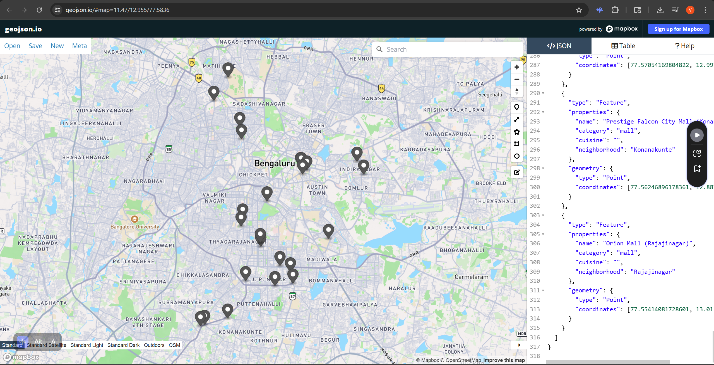
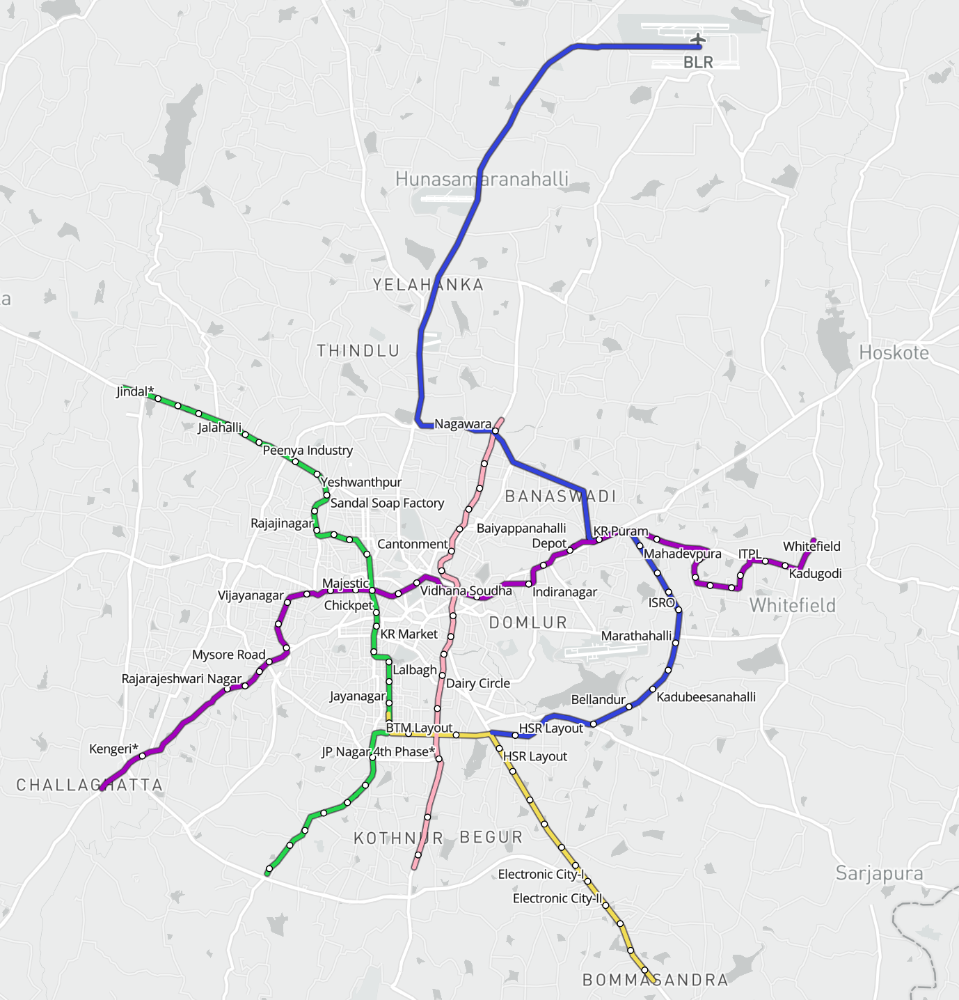

# Assignment 02 - Geoprocessing

## Dataset 1: My Favorite Restaurants in Bengaluru

This dataset contains the locations of restaurants and cafes in Bengaluru that I personally enjoy visiting.  
I created this dataset manually by searching for each location on Google Maps, copying its latitude and longitude coordinates, and then entering these into a GeoJSON file. Each point in the dataset represents one restaurant or cafe, and contains properties such as the name, category, cuisine type, and neighborhood.



The process for creating these points was as follows:
1. I prepared a list of all my favorite restaurants, cafes, and a few malls I visit often.
2. For each place, I searched for it on Google Maps.
3. I copied the exact latitude and longitude coordinates from Google Maps.
4. I pasted these coordinates into a GeoJSON structure, ensuring each feature had a descriptive name and other relevant details.
5. I verified the points by loading the GeoJSON into geojson.io to ensure they were in the correct locations.

This dataset is stored as `blr-restaurants.geojson`.

---

## Dataset 2: Bengaluru Metro Lines and Stations

The related dataset is the Bengaluru Namma Metro network, which I obtained from the [geohacker/namma-metro](https://github.com/geohacker/namma-metro) repository.  
It contains both the metro lines (as LineString features) and the stations (as Point features). I modified the original dataset slightly to adjust styling and correct some details, saving the final file as `metro_lines_styled_cgpt.geojson`.



---

## Proposed Workflow for Relating the Two Datasets

**Goal:** Determine the nearest metro station to each restaurant, and compute the travel route from my home to the restaurant using the metro network where possible.

### Workflow Diagram
```text
[Home Location] --> Find Nearest Metro Station (walking) --> Travel on Metro Network (time & line changes) --> Final Metro Station --> Walk/Drive to Restaurant
```

### Steps:
1. Take the coordinates of my home and find the nearest metro station from the metro dataset.
2. From that station, compute the shortest travel path through the metro network to the station nearest the chosen restaurant.
3. Calculate total travel time:
   - Walking time from home to station
   - Metro travel time based on distance and speed
   - Time for line changes (if any)
   - Walking/driving time from the last station to the restaurant
4. If certain metro lines are unavailable (unchecked in the map UI), recalculate using available lines and more road travel.

---

## Related Dataset Access
- **Restaurants dataset:** `blr-restaurants.geojson`
- **Metro dataset:** `metro_lines_styled_cgpt.geojson`
